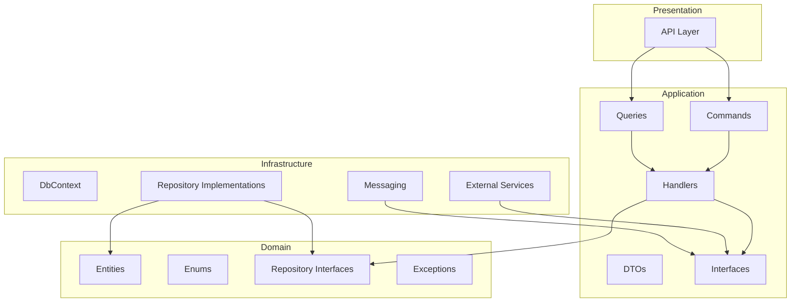

# Arquitetura - MS Ordens de Serviço

## Visão Geral

Este microsserviço foi reestruturado seguindo **Clean Architecture** com **CQRS** (Command Query Responsibility Segregation).

## Diagrama de Camadas

```
┌─────────────────────────────────────────────────────────────────┐
│                           API                                   │
│  Controllers, DTOs de Request/Response, Filters, Jobs           │
│  Depende de: Application, Infrastructure                        │
├─────────────────────────────────────────────────────────────────┤
│                       APPLICATION                               │
│  Commands, Queries, Handlers, DTOs, Validators, Behaviors       │
│  IntegrationEvents, Interfaces de Serviços Externos             │
│  Depende de: Domain                                             │
├─────────────────────────────────────────────────────────────────┤
│                         DOMAIN                                  │
│  Entities, Enums, Exceptions, Interfaces de Repository          │
│  Depende de: NADA (camada pura)                                 │
├─────────────────────────────────────────────────────────────────┤
│                      INFRASTRUCTURE                             │
│  DbContext, Repositories, Configurations, External Services     │
│  Messaging (MassTransit), EventPublisher                        │
│  Depende de: Domain, Application                                │
└─────────────────────────────────────────────────────────────────┘
```

## Fluxo de Dependências (Mermaid)



## Estrutura de Pastas

```
src/
├── API/                          # Camada de Apresentação
│   ├── Controllers/              # Endpoints REST
│   ├── DTOs/Requests/            # DTOs de entrada da API
│   ├── Filters/                  # Exception filters
│   ├── Jobs/                     # Background jobs (Hangfire)
│   └── Program.cs                # Configuração da aplicação
│
├── Application/                  # Camada de Aplicação
│   ├── Commands/                 # Comandos CQRS
│   │   ├── CriarOrdemServico/
│   │   ├── GerarOrcamento/
│   │   ├── AprovarOrcamento/
│   │   └── IniciarPagamento/
│   ├── Queries/                  # Queries CQRS
│   │   ├── ObterOrdemServicoPorId/
│   │   ├── ObterOrdensPorCliente/
│   │   └── ObterOrdensPorStatus/
│   ├── Common/
│   │   ├── Interfaces/           # IEventPublisher, ICadastrosService
│   │   ├── Behaviors/            # ValidationBehavior
│   │   └── DTOs/                 # DTOs de serviços externos
│   ├── DTOs/                     # DTOs de domínio
│   ├── IntegrationEvents/        # Eventos de integração cross-service
│   ├── Mappings/                 # Extension methods de mapeamento
│   └── DependencyInjection.cs
│
├── Domain/                       # Camada de Domínio (PURA)
│   ├── Entities/
│   │   ├── Base/Entity.cs
│   │   ├── OrdemServico.cs
│   │   ├── Orcamento.cs
│   │   ├── Pagamento.cs
│   │   └── InsumoOS.cs
│   ├── Enums/
│   ├── Exceptions/DomainException.cs
│   └── Interfaces/               # Interfaces de Repository
│
└── Infrastructure/               # Camada de Infraestrutura
    ├── Persistence/
    │   ├── OrdensDbContext.cs
    │   ├── Configurations/       # EF Core configurations
    │   ├── Repositories/
    │   └── UnitOfWork.cs
    ├── Messaging/
    │   ├── EventPublisher.cs
    │   └── Consumers/
    ├── ExternalServices/
    │   ├── CadastrosApiClient.cs
    │   ├── MercadoPagoService.cs
    │   └── SagaTimeoutService.cs
    └── DependencyInjection.cs
```

## Padrões Aplicados

| Padrão | Uso |
|--------|-----|
| **CQRS** | Separação de Commands e Queries com MediatR |
| **Repository** | Abstração de acesso a dados |
| **Unit of Work** | Gerenciamento de transações |
| **Mediator** | MediatR para desacoplamento |
| **Dependency Injection** | Inversão de dependências |
| **Event-Driven** | MassTransit para eventos async |

## Princípios SOLID Aplicados

- **S** - Single Responsibility: Cada handler tem uma única responsabilidade
- **O** - Open/Closed: Novos handlers sem modificar existentes
- **L** - Liskov Substitution: Interfaces bem definidas
- **I** - Interface Segregation: Interfaces específicas por contexto
- **D** - Dependency Inversion: Domain não depende de Infrastructure
