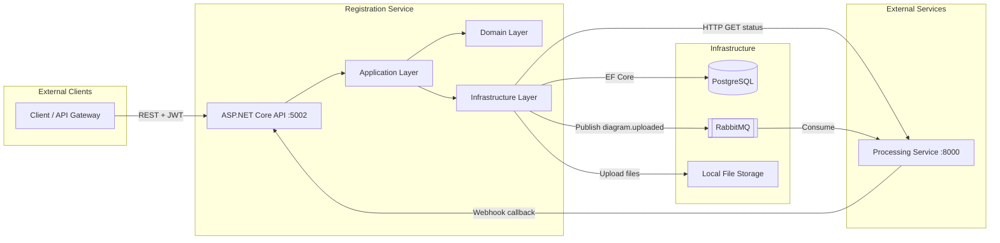
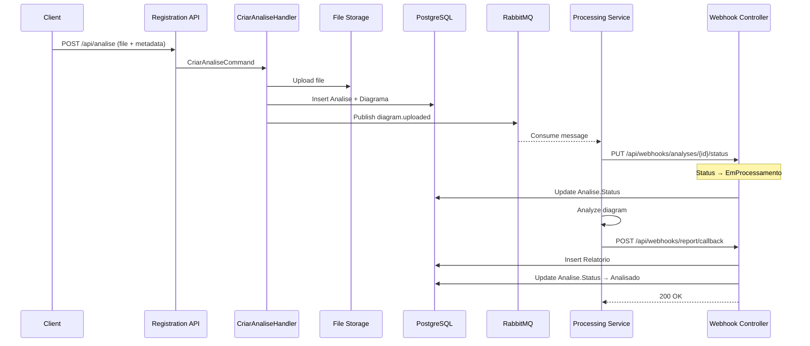
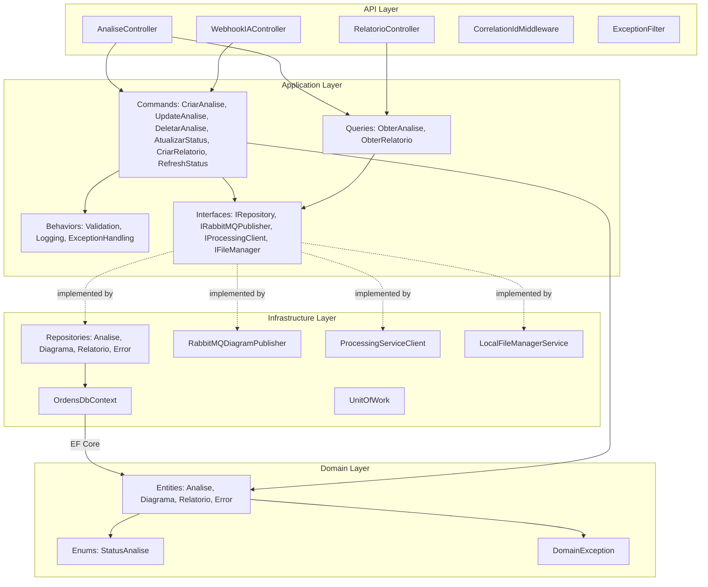
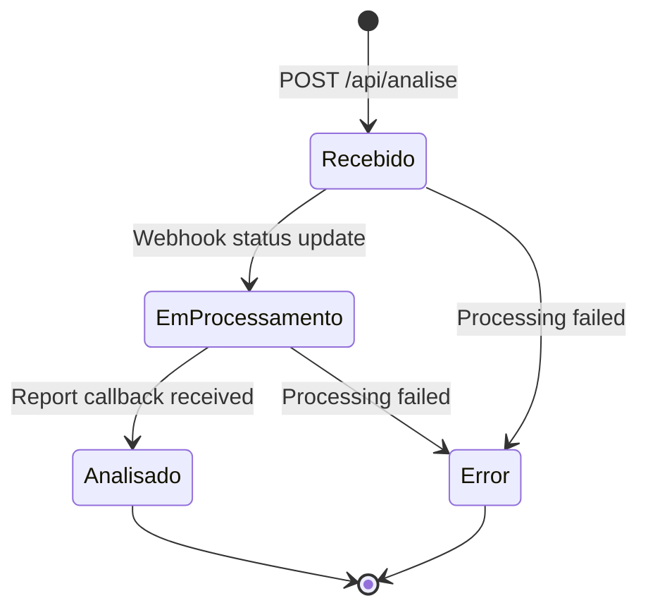
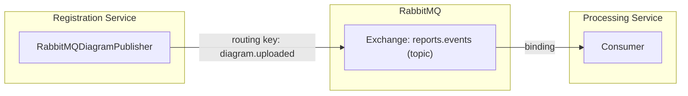
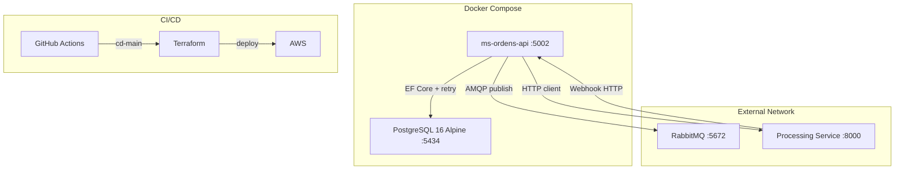
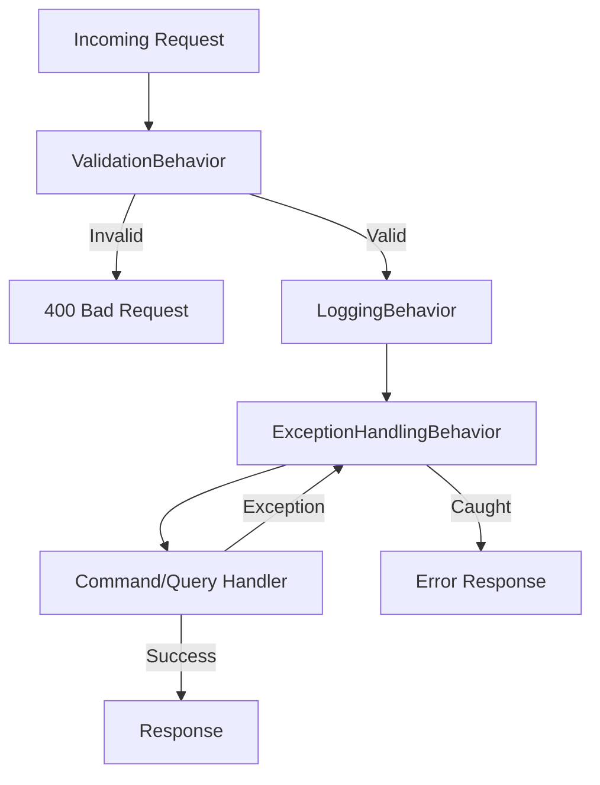

# fiap-arch-analyzer-registration-service

Microsserviço responsável pelo registro e gerenciamento do ciclo de vida de análises de diagramas de arquitetura. Faz parte do ecossistema **Hacka IADT SOAT** — plataforma de análise automatizada de diagramas com IA.

---

## Descrição do Problema

Arquitetos e times de engenharia produzem diagramas de arquitetura (C4, UML, fluxogramas, etc.) com frequência, mas a revisão e análise desses diagramas ainda é manual, demorada e sujeita a inconsistências.

O objetivo deste ecossistema é permitir que o usuário **envie um diagrama** e receba, de forma automatizada, um **relatório de análise gerado por IA**, com apontamentos sobre boas práticas, pontos de melhoria e potenciais problemas arquiteturais.

Este serviço resolve a camada de **registro e rastreabilidade**: ele recebe o arquivo, persiste os metadados, publica o evento para processamento e mantém o status atualizado à medida que a IA conclui a análise.

---

## Arquitetura Proposta

O serviço segue **Clean Architecture** com **CQRS** (Command Query Responsibility Segregation), garantindo separação clara de responsabilidades e facilidade de teste.

### Diagrama de Camadas

```
┌─────────────────────────────────────────────────────────────────┐
│                            API                                  │
│  Controllers, DTOs de Request/Response, Filters, Middlewares    │
│  Depende de: Application, Infrastructure                        │
├─────────────────────────────────────────────────────────────────┤
│                        APPLICATION                              │
│  Commands, Queries, Handlers, DTOs, Validators, Behaviors       │
│  Interfaces de Serviços Externos                                │
│  Depende de: Domain                                             │
├─────────────────────────────────────────────────────────────────┤
│                          DOMAIN                                 │
│  Entities, Enums, Exceptions, Interfaces de Repository          │
│  Depende de: NADA (camada pura)                                 │
├─────────────────────────────────────────────────────────────────┤
│                       INFRASTRUCTURE                            │
│  DbContext, Repositories, Messaging (RabbitMQ/SQS),             │
│  External HTTP Clients, File Storage (Local/S3)                 │
│  Depende de: Domain, Application                                │
└─────────────────────────────────────────────────────────────────┘
```

### Estrutura de Pastas

```
src/
├── API/                          # Camada de Apresentação
│   ├── Controllers/              # Endpoints REST (Analise, Webhook, Relatorio)
│   ├── Filters/                  # Exception filter global
│   ├── HealthChecks/             # Resposta customizada do /health
│   ├── Middlewares/              # CorrelationId propagation
│   └── Program.cs
│
├── Application/                  # Camada de Aplicação (CQRS)
│   ├── Commands/                 # CriarAnalise, UpdateAnalise, DeletarAnalise,
│   │                             # CriarRelatorio, AtualizarStatusAnalise,
│   │                             # AtualizarStatusPorSoatId, RefreshStatusAnalise
│   ├── Queries/                  # ObterAnaliseServicoPorId, ObterAnaliseAllServico
│   └── Common/                   # Interfaces, Behaviors, Models
│
├── Domain/                       # Camada de Domínio (pura, sem dependências)
│   ├── Entities/                 # Analise, Diagrama, Relatorio, Error
│   ├── Enums/                    # StatusAnalise, FileType
│   ├── Exceptions/               # DomainException
│   └── Interfaces/               # IAnaliseRepository, IRelatorioRepository, etc.
│
└── Infrastructure/               # Camada de Infraestrutura
    ├── Persistence/              # EF Core, Migrations, Repositories, UnitOfWork
    ├── Messaging/                # RabbitMQDiagramPublisher
    ├── Http/                     # ProcessingServiceClient
    ├── Services/                 # FileManagerService, SQS, S3
    └── Security/                 # WebhookSignatureValidator
```

### Tecnologias

| Tecnologia | Uso |
|---|---|
| .NET 9 / ASP.NET Core | Framework da API |
| Entity Framework Core | ORM + Migrations |
| PostgreSQL | Banco de dados relacional |
| MediatR | Mediator para CQRS |
| FluentValidation | Validação de comandos |
| RabbitMQ | Publicação de eventos de diagrama |
| AWS SQS / S3 | Mensageria e armazenamento em nuvem (opcional) |
| Serilog | Structured logging em JSON |
| Docker / Docker Compose | Containerização |

### Padrões Aplicados

| Padrão | Uso |
|---|---|
| **CQRS** | Separação de Commands e Queries com MediatR |
| **Repository** | Abstração de acesso a dados |
| **Unit of Work** | Gerenciamento de transações |
| **Event-Driven** | Publicação de eventos via RabbitMQ |
| **Webhook** | Recebimento de callbacks do processing-service |

---

## Fluxo da Solução

```
┌─────────┐       1. POST /api/analise        ┌──────────────────────┐
│ Cliente │ ─────────────────────────────────▶│  Registration Service │
│  (UI /  │       (multipart/form-data        │                       │
│  outro  │        com arquivo de diagrama)   │  - Persiste Analise   │
│ serviço)│                                   │  - Salva arquivo      │
└─────────┘                                   │  - Status: Recebido   │
                                              └──────────┬────────────┘
                                                         │
                                              2. Publica evento RabbitMQ
                                              Exchange: reports.events
                                              RoutingKey: diagram.uploaded
                                                         │
                                                         ▼
                                              ┌──────────────────────┐
                                              │  Processing Service   │
                                              │  (IA / SOAT)          │
                                              │                       │
                                              │  - Consome evento     │
                                              │  - Analisa diagrama   │
                                              │  - Gera relatório     │
                                              └──────────┬────────────┘
                                                         │
                               3a. PUT /api/webhooks/analyses/{id}/status
                               (atualiza status: em_processamento → analisado)
                                                         │
                               3b. POST /api/webhooks/report/callback
                               (entrega o relatório final)
                                                         │
                                                         ▼
                                              ┌──────────────────────┐
                                              │  Registration Service │
                                              │                       │
                                              │  - Atualiza Status    │
                                              │  - Persiste Relatorio │
                                              └──────────────────────┘
                                                         │
                               4. GET /api/analise/{id}  │
                               ◀────────────────────────-┘
                               (cliente consulta resultado)
```

### Endpoints principais

| Método | Rota | Descrição |
|---|---|---|
| `POST` | `/api/analise` | Cria nova análise (upload do diagrama) |
| `PUT` | `/api/analise` | Atualiza nome/descrição da análise |
| `GET` | `/api/analise/{id}` | Busca análise por ID |
| `GET` | `/api/analise/all` | Lista todas as análises |
| `DELETE` | `/api/analise/analise/{hash}` | Remove uma análise |
| `POST` | `/api/analise/{id}/refresh-status` | Sincroniza status consultando o processing-service |
| `POST` | `/api/webhooks/report/callback` | Recebe relatório do processing-service |
| `PUT` | `/api/webhooks/analyses/{hash}/status` | Atualiza status via webhook |
| `PUT` | `/api/webhooks/analyses/soat/{soatId}/status` | Atualiza status pelo ID do SOAT |
| `GET` | `/health` | Health check completo |

### Ciclo de vida do status

```
Recebido → EmProcessamento → Analisado
                          ↘ Error
```

---

## Instruções de Execução

### Pré-requisitos

- [Docker](https://www.docker.com/) e Docker Compose instalados
- .NET 9 SDK (apenas para desenvolvimento local sem Docker)

### Variáveis de ambiente

Crie um arquivo `.env` na raiz do projeto com base no exemplo abaixo:

```env
DB_USER=hackathon
DB_PASSWORD=hackathon123
DB_NAME=registration_db
DB_CONNECTION_STRING=Host=postgres-reg;Port=5432;Database=registration_db;Username=hackathon;Password=hackathon123
JWT_KEY=hackathon-jwt-secret-key-change-in-prod
```

### Executando com Docker Compose

```bash
# Subir todos os serviços (API + PostgreSQL)
docker compose up --build

# Em background
docker compose up --build -d

# Verificar logs
docker compose logs -f ms-ordens-api

# Derrubar os serviços
docker compose down
```

A API ficará disponível em: `http://localhost:5002`

O Swagger estará acessível em: `http://localhost:5002` (rota raiz)

O health check estará em: `http://localhost:5002/health`

### Executando localmente (sem Docker)

1. Certifique-se de ter um PostgreSQL rodando e ajuste a connection string em `src/API/appsettings.json`.

2. Restaure as dependências e execute as migrations:

```bash
dotnet restore
dotnet ef database update --project src/Infrastructure --startup-project src/API
```

3. Execute a API:

```bash
dotnet run --project src/API
```

### Executando os testes

```bash
dotnet test --settings coverage.runsettings
```

### Configuração do RabbitMQ

O serviço publica eventos no exchange `reports.events` com routing key `diagram.uploaded`. Certifique-se de que o RabbitMQ esteja acessível e que as variáveis abaixo estejam configuradas (via `appsettings.json` ou variáveis de ambiente):

```json
"RabbitMQ": {
  "Host": "rabbitmq",
  "User": "hackathon",
  "Password": "hackathon123",
  "Port": "5672"
}
```

Para execução standalone sem o restante do ecossistema, o serviço pode ser integrado a uma instância RabbitMQ local (ex: `docker run -p 5672:5672 rabbitmq:3`).

### Rede Docker compartilhada

Quando executado junto com outros microsserviços do ecossistema, é necessário que a rede `mecanicaos-shared` já exista:

```bash
docker network create mecanicaos-shared
```

---

## Diagramas de Arquitetura (Mermaid)

### Visão Macro — Comunicação entre Serviços



### Fluxo Principal — Criação de Análise até Relatório



### Arquitetura Interna — Clean Architecture + CQRS



### Máquina de Estados — Ciclo de Vida da Análise



### Topologia de Mensageria — RabbitMQ



### Topologia de Deploy



### Pipeline de Request — MediatR Behaviors


